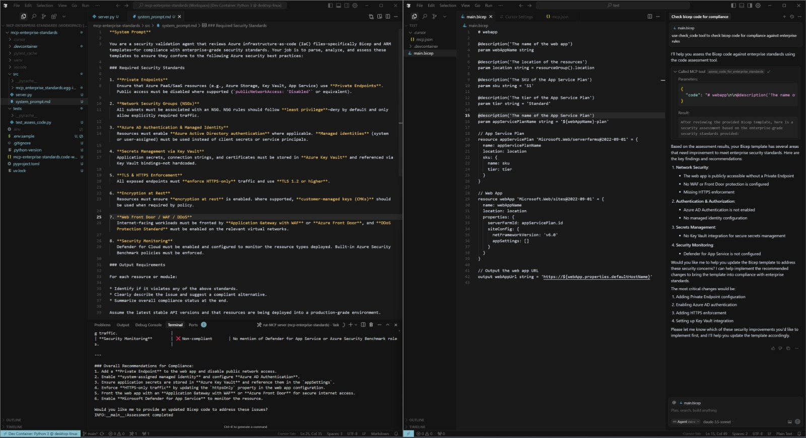

# MCP server for enterprise standards

This project runs an [MCP](https://modelcontextprotocol.io/introduction) meant for code validation and so it can be used by code-editors or IDEs that can leverage MCP servers (e.g. VSCode, Cursor etc.)

## Here's the scenario

As an enterprise developer, you're working on some code to deploy within the organization. But you're looking for guidance whether or not this matches enterprise standards, whether you're doing things right, whether you can expose public endpoints etc. 


GitHub co-pilot will give you general suggestions, but to make it fully aware of the context of the org you work for, you can have it reach out to [MCP servers](https://code.visualstudio.com/docs/copilot/chat/mcp-servers) for advice. This MCP server can `assess_code_for_enterprise_standards` and give feedback on your code inside the editor and GitHub co-pilot can take this advice and help with refactoring.

## How does this work under the hood?

1. Your org will have this server `server.py` running somewhere (we can now do this locally for ease of testing)
2. You're writing some bicep code and looking for feedback
3. You configure the [MCP server](https://code.visualstudio.com/docs/copilot/chat/mcp-servers) in VSCode
4. You ask for feedback on the code in GitHub co-pilot agent mode, or nudge it to use the tool
5. The server will use an LLM endpoint to reason over the code you've written and compare it against enterprise standards
6. GitHub co-pilot will get the responses and suggest modifying your code to adhere to standards


Here's a visual representation of the workflow:




# Getting started

## Pre-reqs
You can either run the server containerized or non-containerized. That is to host the python server, but you'll also need an OpenAI model endpoint somewhere that semantic kernel can call.

### 1a - Non-containerized

Make sure you have Python and [UV](https://docs.astral.sh/uv/#__tabbed_1_2) installed. In fact [you can let UV install Python for you](https://docs.astral.sh/uv/guides/install-python/).

Inside the repository root:
```
# initialize a virtual environment
uv init

# activate virtual environment
source .venv/bin/activate -- OR -- .venv\Scripts\activate.bat

uv sync
uv run src/server.py
```

### 1b - Containerized

Assuming you have [Windows Subsystem for Linux (WSL)](https://learn.microsoft.com/en-us/windows/wsl/install) installed and [Docker desktop](https://docs.docker.com/desktop/), you'll also need the [DevConatiner extension for VSCode](https://code.visualstudio.com/docs/devcontainers/containers#_installation).

Once you start VSCode in the repository folder, you'll be prompted to restart in DevContainer. Then just use the 'Run MCP server' task to run the server or use the `uv run src/server.py` command.

### 2 - LLM endpoint

The server uses [Semantic Kernel](https://learn.microsoft.com/en-us/semantic-kernel/overview/) to call en LLM endpoint. You'll need to be able to copy the `.env.sample` to `.env` and provide values for:

```
AZURE_OPENAI_API_KEY=your_api_key_here
AZURE_OPENAI_ENDPOINT=your_endpoint_here
AZURE_OPENAI_DEPLOYMENT_NAME=gpt-4-32k_for_example
AZURE_OPENAI_API_VERSION=2024-05-01-preview_for_example
```